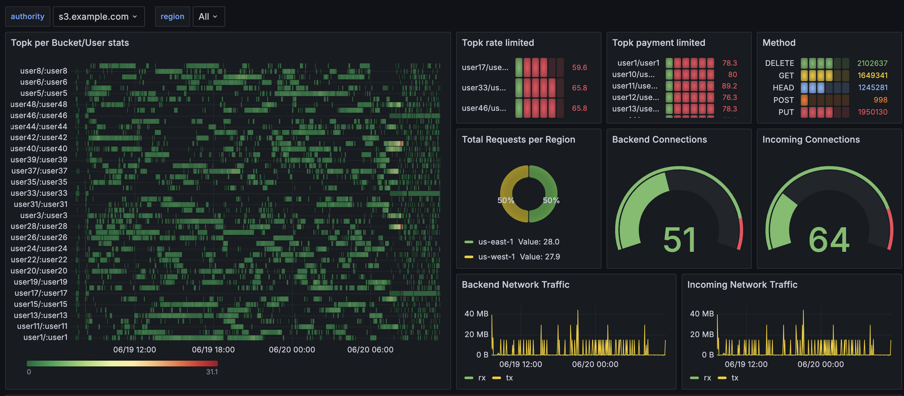
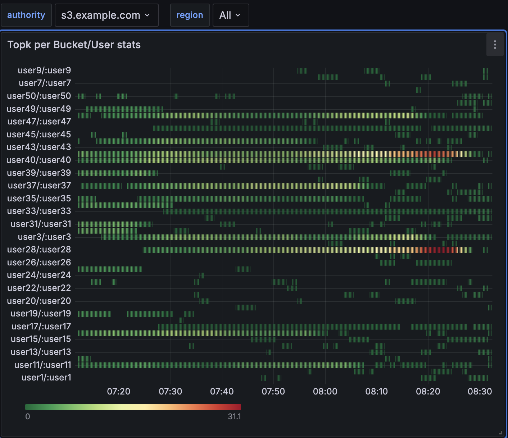
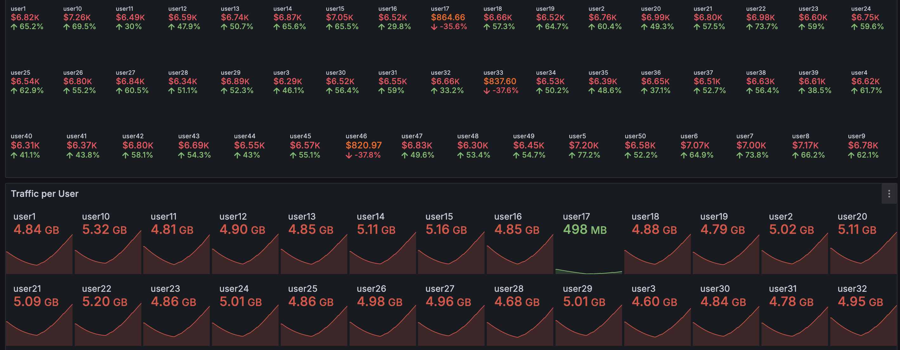
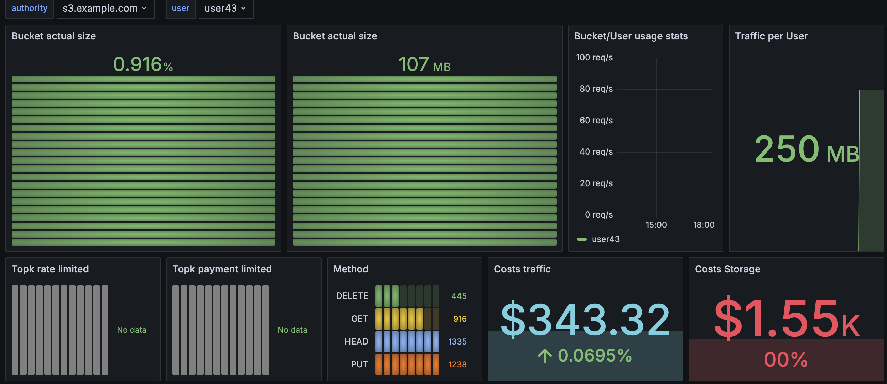
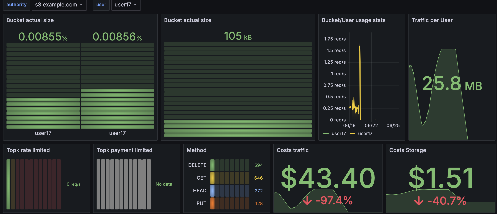
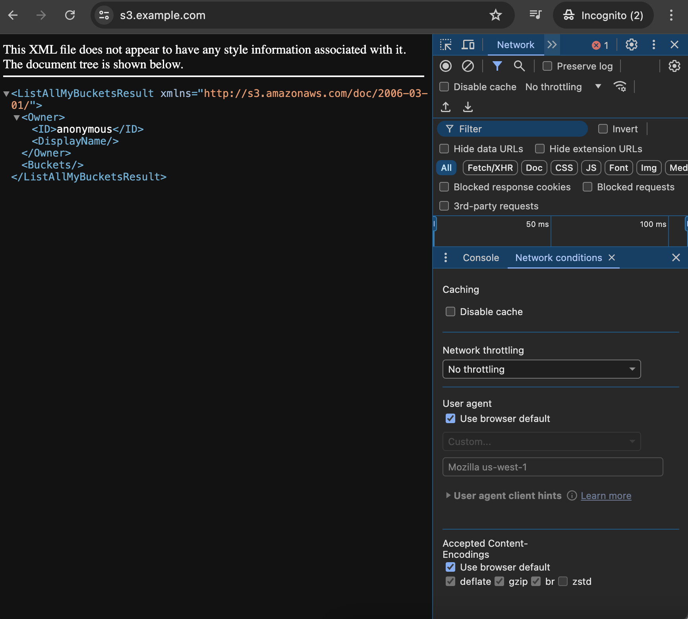
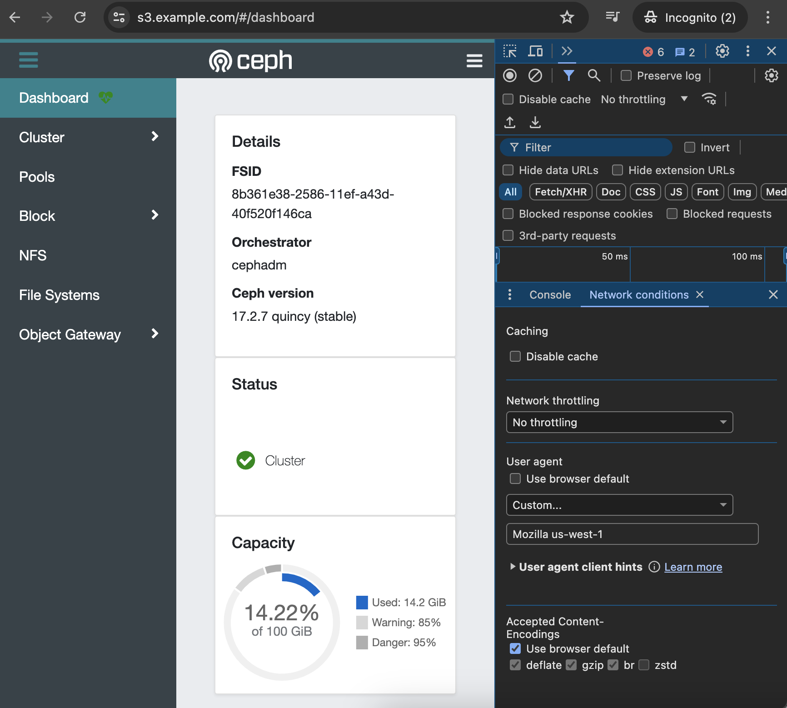

# Dashboards 

With the metrics provided by the Flask API, it is possible to create highly detailed dashboards that effectively 
visualize what, when, and where.

By zooming in on peaks, it becomes clear which entities or users are responsible for generating the majority of 
traffic.

By capturing traffic bytes as a metric and consolidating it with bucket-at-rest metrics, leveraging Prometheus 
enables effortless FinOps.

For large-scale deployments, creating per-user detail dashboards is essential to maintaining readability.

# Routing capbilities

Although browsers do not natively provide S3 capabilities for users, Developer Mode offers the ability to 
override the User-Agent, allowing developers to effectively demonstrate Envoy's features.

